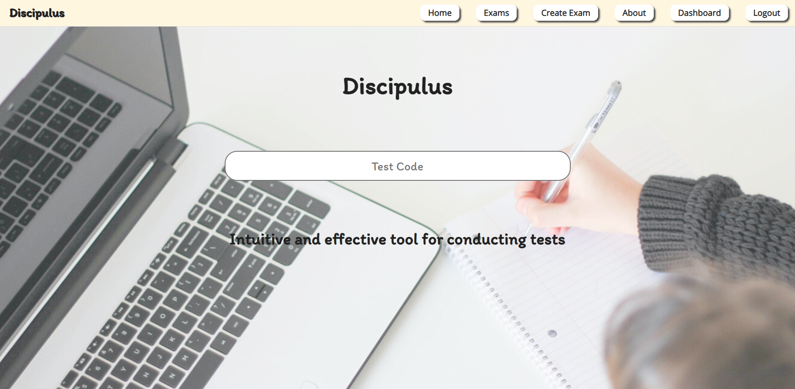
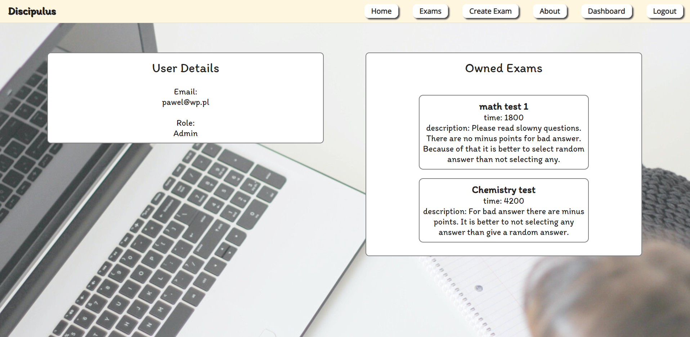
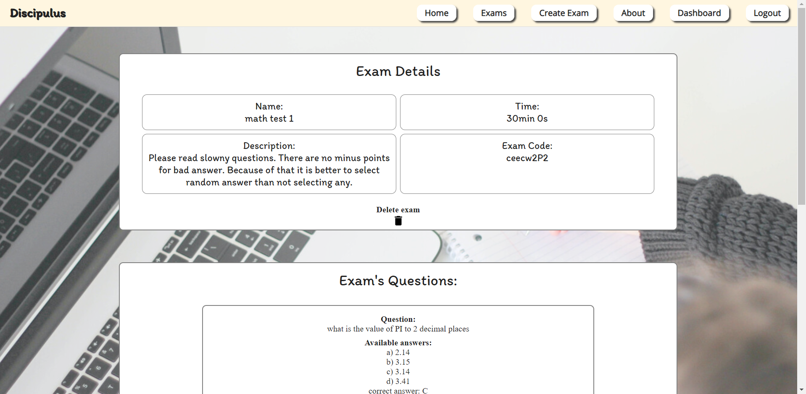

<!-- Heading -->
## Web application for online tests

#### Backend: Node js with express

#### Frontend: monolithic application with server-site rendering using handlebars.

#### Database: MongoDB (ODM - mongoose)

#### Used modules:
<!-- UL-->
* bcrypt (encrypting passwords)
* body-parser
* cookie-parser
* nodemon 
* randomstring (generate test codes)
* dotenv (store sensitive data)
* eslint (code linting)
* jest (unit tests)
* portfinder (integration tests)
* puppeteer (integration tests)

 

#### Few screens:

